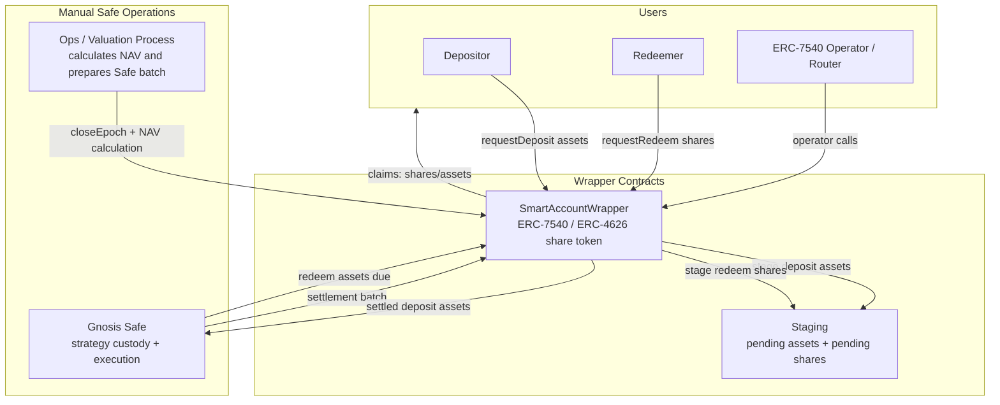
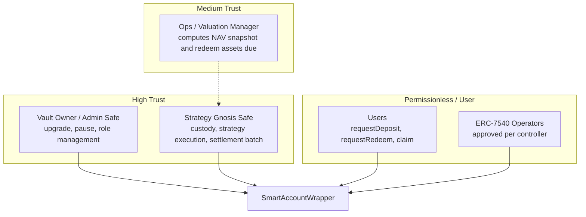
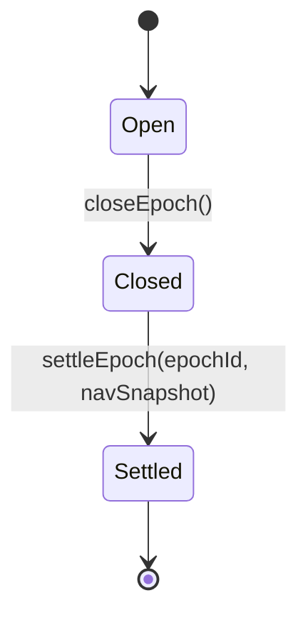
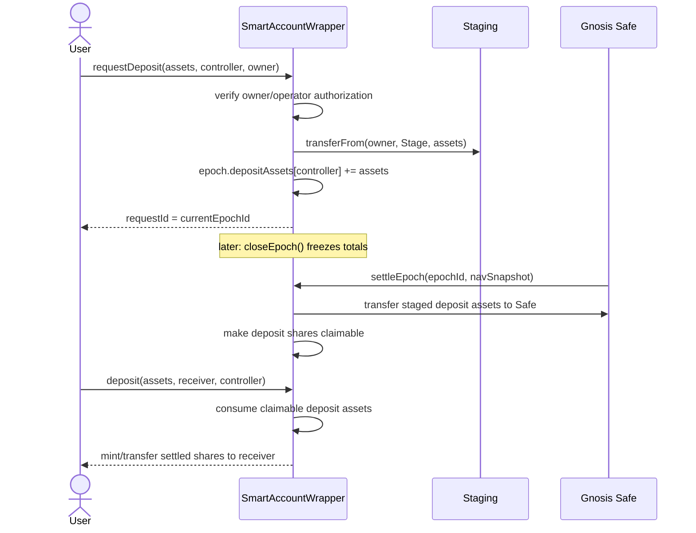
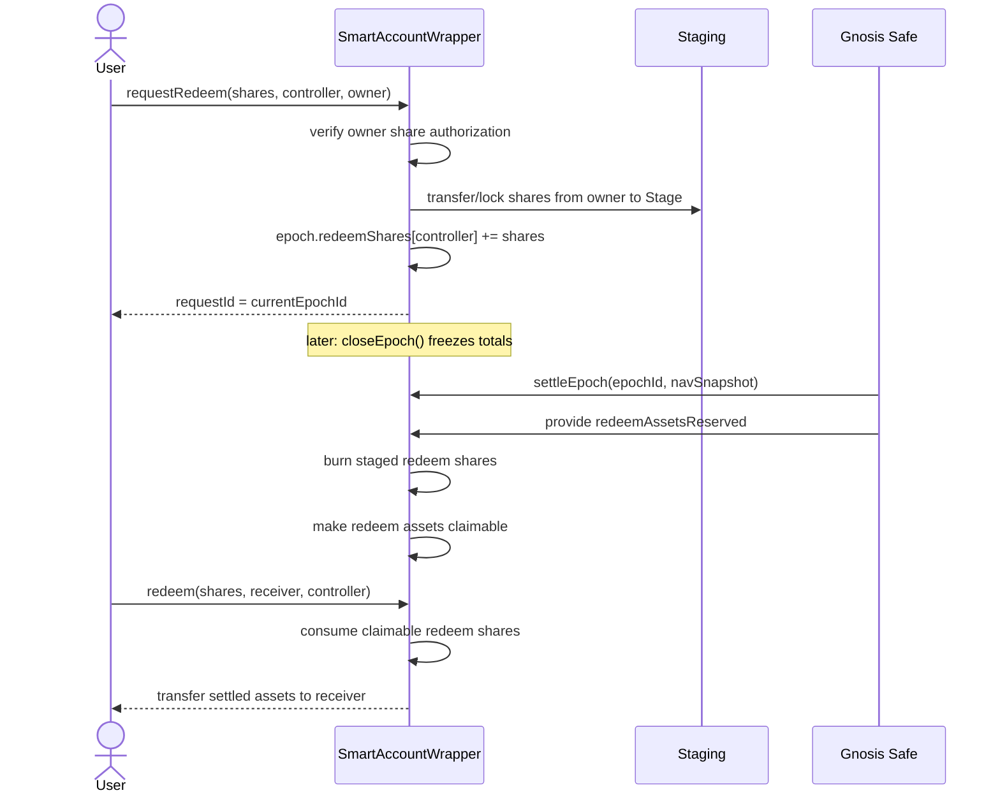

# Epoch-Based ERC-7540 Wrapper — Architecture Specification

> **Audience**: security auditors, integrators, Safe operators, and implementers.
> This document specifies the target architecture for an ERC-7540-compatible vault wrapper around a manually managed Gnosis Safe. It describes the desired epoch/staging design, not the current implementation line-by-line.

---

## Table of Contents

1. [System Overview](#1-system-overview)
2. [Design Goals](#2-design-goals)
3. [Roles & Trust Model](#3-roles--trust-model)
4. [Core Accounting Model](#4-core-accounting-model)
5. [Epoch State Machine](#5-epoch-state-machine)
6. [Deposit Flow](#6-deposit-flow)
7. [Redeem / Withdrawal Flow](#7-redeem--withdrawal-flow)
8. [Settlement Flow](#8-settlement-flow)
9. [Claim Flow](#9-claim-flow)
10. [ERC-7540 / ERC-4626 API Compatibility](#10-erc-7540--erc-4626-api-compatibility)
11. [Operator System](#11-operator-system)
12. [Asset Movement](#12-asset-movement)
13. [Key Invariants](#13-key-invariants)
14. [Known Tradeoffs & Assumptions](#14-known-tradeoffs--assumptions)
15. [Contract Reference](#15-contract-reference)
16. [Decisions and Remaining Open Questions](#16-decisions-and-remaining-open-questions)

---

## 1. System Overview

The wrapper is a **fully asynchronous ERC-7540 vault** around a manually managed Gnosis Safe. Users can request deposits and redemptions permissionlessly, but **no user request is priced immediately**. Requests are staged into the currently open epoch. A Safe/operator later closes the epoch, calculates a NAV snapshot, moves the required assets, and settles the closed epoch. Users then claim settled shares or assets through the standard ERC-4626 claim functions required by ERC-7540.

The system replaces immediate NAV-dependent pricing with a deterministic staging flow:

```text
request -> stage assets/shares -> close epoch -> Safe NAV settlement -> claim
```

**Key properties:**

- Deposits are **asynchronous**: `requestDeposit` stages assets; `deposit` / `mint` claim settled shares.
- Redemptions are **asynchronous**: `requestRedeem` stages shares; `redeem` / `withdraw` claim settled assets.
- A single **settlement epoch** contains both deposit and redeem buckets.
- Epochs are closed before ops calculates NAV, so outstanding requests cannot change during settlement preparation.
- The Gnosis Safe remains the active strategy/custody account and is manually managed by ops.
- Staged deposit assets are not active Safe NAV until settlement.
- Staged redeem shares are not priced until settlement.
- ERC-7540 compatibility is preferred over legacy custom claim helpers.



---

## 2. Design Goals

1. **Remove stale-NAV pricing from user calls.** User requests must not mint shares or compute redeem assets using stale manually reported NAV.
2. **Use one settlement boundary.** Deposits and redemptions in the same epoch are settled against the same NAV snapshot.
3. **Make ops calculations stable.** Ops closes/freezes an epoch before calculating NAV and required asset movements.
4. **Stay ERC-7540 compatible.** ERC-4626 `deposit`, `mint`, `redeem`, and `withdraw` are claim functions for claimable requests.
5. **Support manually managed Safe custody.** Settlement must work when the Safe cannot be synchronously called by arbitrary users to update NAV.
6. **Keep settlement atomic from the protocol's perspective.** Safe asset movement and vault settlement should happen in one Safe transaction batch; the settlement function verifies the post-transfer reserve invariant.
7. **Prefer simple linear accounting.** Only one epoch can be frozen at a time; the frozen epoch must settle before another freeze can be initiated.

### Initial design decisions

- **Settlement supports netting.** Staged deposits may be used as part of the assets available for redeem claims. The settlement invariant is that, after settlement accounting and any staged-deposit transfer to the Safe, the wrapper/Staging system has enough underlying assets reserved for all redeem claims in the settled epoch.
- **Only the Safe closes and settles epochs.** The Safe is controlled by ops, so v1 does not need a separate keeper, valuation manager, or permissionless close path.
- **At most one frozen epoch may exist.** Once the Safe closes an epoch, `closeEpoch()` must revert until that frozen epoch is settled. New requests still enter the next open epoch, but ops cannot create another frozen batch before finalizing the current one.
- **Cancellation is omitted in v1.** ERC-7540 does not require cancellation; cancellation is covered by a separate optional extension. If cancellation is later added, it must be limited to open epochs only.
- **Multiple unclaimed epochs per controller are supported.** Epochs are isolated; a controller can have claimable balances from more than one settled epoch.
- **Claims consume the oldest claimable epoch only.** A single ERC-4626 claim call does not span multiple epochs. Users/controllers repeat claims to consume later epochs.
- **NAV is post-fee.** `navSnapshot` should be reported after management/performance/strategy fees have already been applied at the Safe/accounting layer.
- **Redeem funding is pre-transferred by the Safe.** The backoffice system batches the asset transfer and `settleEpoch` call in the same Safe transaction batch; the vault does not pull redeem assets from Safe allowance in v1.
- **Pending assets and shares live in a separate `Staging` contract.** The name and design should be project-specific and should not reference third-party implementations.
- **No synchronous deposit or withdrawal path in v1.** All user entry and exit goes through ERC-7540 request and claim flows.
- **Rounding dust stays with remaining shareholders.** Settlement and claim rounding residuals are not redirected to a fee receiver in v1.

---

## 3. Roles & Trust Model



**Trust assumptions:**

1. **Vault owner/admin** can upgrade and pause the vault. Users trust the upgrade/admin process.
2. **Strategy Safe** holds active assets and executes strategies. It is the only v1 actor allowed to close and settle epochs. It must pre-transfer enough assets during settlement for redeem claims.
3. **Ops / valuation process** controls the Safe and computes the post-fee active Safe NAV used for settlement. Incorrect NAV can misprice an epoch.
4. **Users and ERC-7540 operators** can submit requests but cannot force pricing. They only receive settlement pricing once an epoch is settled.

---

## 4. Core Accounting Model

The vault separates active assets from staged requests.

### Active assets

`totalAssets()` should represent the last settled active NAV of the vault after all prior settled epochs have been incorporated. It should **exclude** staged deposit assets, redeem assets sent temporarily for settlement, and other temporary settlement buffers.

This means the implementation must keep separate accounting buckets for assets that can sit in the wrapper/Staging system at the same time:

- open-epoch staged deposit assets,
- the single frozen epoch's staged deposit assets,
- assets pre-transferred by the Safe for the frozen epoch settlement,
- redeem claim reserves from already settled epochs,
- true surplus assets that can be moved to the Safe.

The settlement logic must never treat the raw ERC-20 balance of the wrapper or Staging contract as a single fungible pool. In particular, deposits submitted to the newly opened epoch after `closeEpoch()` must not be used to fund redemption claims for the frozen epoch being settled.

### Staged deposit assets

Deposit requests transfer underlying assets into staging and record assets per controller for the epoch. These assets are not active strategy capital and must not be included in active NAV before settlement.

### Staged redeem shares

Redeem requests transfer/lock vault shares into staging and record shares per controller for the epoch. Preferred design: keep these shares outstanding until settlement, then burn them during settlement. This keeps `totalSupply()` aligned with the settlement NAV snapshot.

Like staged assets, staged shares must be accounted per epoch. Settlement burns only the frozen epoch's redeem shares and must not touch shares staged for the currently open epoch.

### Settlement snapshots

Each settled epoch records the price basis used by claim functions:

```solidity
struct SettlementData {
    uint256 navSnapshot;          // active Safe NAV before processing this epoch
    uint256 totalSupplySnapshot;  // share supply used for this epoch's price
    uint256 totalDepositAssets;   // frozen deposit assets in this epoch
    uint256 totalRedeemShares;    // frozen redeem shares in this epoch
    uint256 depositSharesMinted;  // shares made claimable for depositors
    uint256 redeemAssetsReserved; // assets reserved for redeemers
    bool settled;
}
```

The settlement price is:

```text
pricePerShare = navSnapshot / totalSupplySnapshot
```

Deposits and redeems in the same epoch use the same price.

---

## 5. Epoch State Machine

The vault uses **one epoch ID** for both deposits and redemptions. Each epoch has two request buckets:

```solidity
struct EpochData {
    EpochStatus status; // Open, Closed, Settled
    uint256 totalDepositAssets;
    uint256 totalRedeemShares;
    mapping(address controller => uint256 assets) depositAssets;
    mapping(address controller => uint256 shares) redeemShares;
}
```



### Open epoch

- Users may call `requestDeposit` and `requestRedeem`.
- Cancellation is not implemented in v1. If a future optional cancellation extension is added, it must only apply to open-epoch requests.
- Requests in this epoch are pending.

### Close / freeze

`closeEpoch()` freezes the current epoch and immediately opens the next epoch. It may only be called when there is no existing closed-but-unsettled epoch.

- The closed epoch's deposit and redeem totals become fixed.
- New requests go into the new current epoch.
- Ops can calculate NAV and required asset movement against fixed totals.
- The frozen epoch must be settled before the Safe can freeze another epoch.
- This gives ops a stable settlement target while still allowing users to keep submitting requests into the new open epoch.

```solidity
event EpochClosed(
    uint40 indexed epochId,
    uint40 indexed nextEpochId,
    uint256 totalDepositAssets,
    uint256 totalRedeemShares
);
```

### Settled epoch

`settleEpoch(epochId, navSnapshot)` records settlement pricing, reserves claim assets, transfers surplus staged deposit assets to the Safe, burns staged redeem shares, mints or reserves deposit claim shares, updates active accounting, and makes requests claimable.

Settlement clears the frozen-epoch lock, allowing the Safe to call `closeEpoch()` again for the currently open epoch.

```solidity
event EpochSettled(
    uint40 indexed epochId,
    uint256 navSnapshot,
    uint256 totalSupplySnapshot,
    uint256 totalDepositAssets,
    uint256 totalRedeemShares,
    uint256 depositSharesMinted,
    uint256 redeemAssetsReserved
);
```

---

## 6. Deposit Flow

Deposits use ERC-7540 async deposit semantics.



**Rules:**

- `requestDeposit` transfers assets into staging and emits `DepositRequest`.
- `requestDeposit` does **not** mint shares.
- `requestDeposit` returns the active `currentEpochId` as `requestId`.
- Multiple deposit requests by the same controller in the same open epoch aggregate.
- A controller may have unclaimed claimable deposit requests from multiple settled epochs. Claim state is tracked per epoch so a new request does not require claiming an older epoch first.
- `deposit` and `mint` are claim functions after settlement and must not transfer assets again.

---

## 7. Redeem / Withdrawal Flow

Redemptions use ERC-7540 async redeem semantics.



**Rules:**

- `requestRedeem` transfers or locks shares into staging and emits `RedeemRequest`.
- `requestRedeem` does **not** compute assets at request time.
- `requestRedeem` returns the active `currentEpochId` as `requestId`.
- Preferred design: shares are transferred to staging at request time and burned at settlement.
- A controller may have unclaimed claimable redeem requests from multiple settled epochs. Claim state is tracked per epoch so a new request does not require claiming an older epoch first.
- `redeem` and `withdraw` are claim functions after settlement and must not transfer or burn shares a second time.

---

## 8. Settlement Flow

Settlement is the only place where NAV affects user pricing.

### NAV definition

`navSnapshot` is the **pre-settlement active Safe NAV**:

```text
navSnapshot = value of active strategy/Safe assets before:
- staged deposit assets are added to the Safe, and
- redeem assets for this epoch are removed from the Safe.
```

It excludes staged deposit assets and temporary redeem settlement buffers.

### Settlement math

Let:

```text
A = navSnapshot
S = totalSupplySnapshot
D = totalDepositAssets in closed epoch
R = totalRedeemShares in closed epoch
```

Then:

```text
depositShares = D * S / A
redeemAssets  = R * A / S
```

After settlement:

```text
newTotalAssets = A + D - redeemAssets
newTotalSupply = S + depositShares - R
```

`totalAssets()` after settlement should report `newTotalAssets` as active assets backing the remaining share supply. Redeem claim reserves are excluded from active assets because the corresponding redeem shares were burned at settlement and the assets are owed to exiting controllers.

### Initial issuance and zero-NAV cases

The formula above assumes both `A > 0` and `S > 0`. The implementation must define explicit bootstrap behavior:

- If `S == 0`, the first settled deposit epoch should use a fixed initial exchange rate, such as `depositShares = D` adjusted for asset/share decimals.
- If `S == 0`, there should be no redeem shares in the epoch.
- If `S > 0` and `A == 0`, deposit settlement cannot use `D * S / A`; either revert deposits for that epoch or require an explicit emergency/recapitalization path.
- If `A == 0`, redeem assets due are zero, but the implementation should still make this an explicit audited branch rather than relying on division behavior.

The v1 implementation should document and test the bootstrap path separately from normal profitable/loss-making epochs.

Rounding rules should be conservative:

- deposit shares round down,
- redeem assets round down,
- `mint` and `withdraw` claim variants use the corresponding ceil math where required by ERC-4626 semantics.

Rounding residuals stay with remaining shareholders in v1. Settlement and claim rounding dust is not redirected to a fee receiver.

### NAV sanity checks

Because NAV is manually reported by the Safe, settlement should include operational guardrails even though the Safe is trusted:

- `navSnapshot` is post-fee and pre-settlement.
- `navSnapshot` must be nonzero when normal settlement math requires division by NAV.
- Optional but recommended: configurable maximum NAV movement per epoch, or at least an event/alert path for abnormal NAV jumps.
- Emergency override paths, if any, should emit distinct events and should not be confused with normal `settleEpoch`.

### Emergency settlement as upgrade-only last resort

The normal path should be Safe pre-transfer plus `settleEpoch`. V1 should not include a separate callable emergency settlement function in the normal implementation.

If a frozen epoch cannot be finalized through the normal path, the emergency hatch is an implementation upgrade through the vault proxy. This is an absolute last resort for severe situations such as:

- a contract bug or integration failure leaves `frozenEpochId` stuck and blocks future freezes,
- the underlying asset was paused, blacklisted, upgraded, or otherwise cannot be transferred normally,
- a strategy loss or exploit makes the reported NAV effectively zero and normal settlement math cannot handle the epoch,
- incorrect assets were transferred during the Safe batch and the epoch needs an audited recovery action,
- the Strategy Safe was migrated or replaced while an epoch is frozen.

Any upgrade-based emergency settlement should be treated as a governance/admin emergency, not as an operational settlement mode. The upgraded implementation should emit distinct emergency events, clearly disclose any impairment or recovery assumptions, and preserve claim-reserve invariants where possible. It should not silently reuse the normal `EpochSettled` event or make emergency impairment look like normal settlement.

### Safe asset movement

Settlement supports **netting** between staged deposit assets and redeem assets due. The Safe still pre-transfers any additional underlying assets needed for redeem claims before calling `settleEpoch`, and the backoffice system batches that transfer with the settlement call.

The implementation should not require a full gross round trip when staged deposit assets can fund some or all redeem claims. Instead, settlement computes the epoch's `redeemAssets`, observes the underlying assets available in the wrapper/Staging system, reserves enough for redeem claims, and transfers only surplus staged deposit assets to the Safe.

Only the frozen epoch's staged deposit assets may be netted against that same frozen epoch's redeem assets due. Assets staged for the newly opened epoch after `closeEpoch()` are not available for the frozen epoch settlement.

Example:

```text
staged deposit assets = 100
redeem assets due     = 40

settlement may reserve 40 for redeem claims
and transfer only 60 net assets to the Safe
```

If redeem assets due exceed staged deposit assets, the Safe pre-transfers the shortfall before settlement:

```text
staged deposit assets = 40
redeem assets due     = 100

Safe pre-transfers 60
settlement reserves 100 for redeem claims
and transfers 0 net assets to the Safe
```

The key invariant is not a specific transfer path. The key invariant is:

```text
post-settlement claim reserve >= redeemAssetsReserved for the epoch
```

### Settlement preconditions

`settleEpoch` should verify:

- `epochId == frozenEpochId`, enforcing that only the single closed-but-unsettled epoch can be settled.
- Epoch is closed and not already settled.
- After netting and any Safe pre-transfer, the wrapper/Staging system has at least `redeemAssets` underlying reserved for claims.
- Staging holds at least the frozen deposit assets and redeem shares.
- Assets staged for any open epoch are excluded from the frozen epoch's settlement reserve calculation.
- The provided `navSnapshot` is nonzero when total supply is nonzero.

If the wrapper/Staging system does not have enough assets for the frozen redeem bucket after netting and Safe pre-transfer, settlement should revert rather than partially settle.

---

## 9. Claim Flow

ERC-7540 requires users to pull outputs through ERC-4626 claim functions. The vault must not push shares or assets directly to users during settlement.

### Deposit claim

Because multiple settled epochs can remain unclaimed for the same controller, claim accounting is tracked by `(epochId, controller)` internally. ERC-4626 claim functions do not include a request ID, so implementation must define a deterministic claim-selection policy. V1 uses the simplest policy: each claim consumes only the controller's oldest claimable epoch for that side. If a controller has claimable balances in later epochs, they must submit additional claim calls after the oldest epoch is fully claimed.

For each settled epoch/controller, the implementation should track both sides of the settled conversion: deposit `assetsClaimable` and `sharesClaimable`, and redeem `sharesClaimable` and `assetsClaimable`. This avoids recalculating with a different rounding mode during claims and lets `deposit`/`mint` and `redeem`/`withdraw` consume the same settlement allocation consistently.

`maxDeposit`, `maxMint`, `maxWithdraw`, and `maxRedeem` should expose only the currently oldest claimable epoch for the controller. They should not aggregate across multiple claimable epochs because one claim call does not span epochs in v1.

`deposit(assets, receiver, controller)`:

- consumes claimable deposit assets for `controller`,
- calculates/uses the settled epoch share amount,
- mints or transfers shares to `receiver`,
- emits ERC-4626 `Deposit`,
- does not transfer underlying assets from caller.

`mint(shares, receiver, controller)` does the same but claims by shares.

### Redeem claim

`redeem(shares, receiver, controller)`:

- consumes claimable redeem shares for `controller`,
- transfers the settled asset amount to `receiver`,
- emits ERC-4626 `Withdraw`,
- does not transfer or burn shares from `controller` at claim time.

`withdraw(assets, receiver, controller)` does the same but claims by assets.

---

## 10. ERC-7540 / ERC-4626 API Compatibility

The target design is **fully asynchronous**: async deposits and async redemptions.

There is no synchronous deposit, mint, withdraw, or redeem path in v1. The inherited ERC-4626 methods are claim functions only, as required for the async sides of ERC-7540.

### Required ERC-7540 surface

The active epoch ID is the ERC-7540 `requestId`. Multiple requests from the same controller in the same epoch aggregate under the same `(requestId, controller)` pair. Requests sharing a nonzero epoch ID are fungible: they freeze together, settle together, and receive the same exchange rate.

| Function | Target behavior |
|---|---|
| `requestDeposit(uint256 assets, address controller, address owner)` | Transfer assets from owner to staging; record pending deposit assets in current epoch; return `currentEpochId`; emit `DepositRequest`. |
| `pendingDepositRequest(uint256 requestId, address controller)` | Return assets for open/closed but unsettled epoch; exclude claimable settled amounts; caller-independent. |
| `claimableDepositRequest(uint256 requestId, address controller)` | Return settled deposit assets not yet claimed; exclude pending amounts; caller-independent. |
| `requestRedeem(uint256 shares, address controller, address owner)` | Transfer/lock shares from owner into staging; record pending redeem shares in current epoch; return `currentEpochId`; emit `RedeemRequest`. |
| `pendingRedeemRequest(uint256 requestId, address controller)` | Return shares for open/closed but unsettled epoch; exclude claimable settled amounts; caller-independent. |
| `claimableRedeemRequest(uint256 requestId, address controller)` | Return settled redeem shares not yet claimed; exclude pending amounts; caller-independent. |
| `setOperator(address operator, bool approved)` | Approve/revoke operator for caller/controller. |
| `isOperator(address controller, address operator)` | Return operator approval status. |

### ERC-4626 functions changed by ERC-7540

Because both sides are async:

| ERC-4626 function | Target behavior |
|---|---|
| `deposit(uint256 assets, address receiver)` | Claim caller/controller's settled deposit request. Does not transfer assets. |
| `deposit(uint256 assets, address receiver, address controller)` | ERC-7540 controller-aware deposit claim. |
| `mint(uint256 shares, address receiver)` | Claim caller/controller's settled deposit request by shares. Does not transfer assets. |
| `mint(uint256 shares, address receiver, address controller)` | ERC-7540 controller-aware mint claim. |
| `withdraw(uint256 assets, address receiver, address controller)` | Claim settled redeem request by assets. Does not transfer/burn shares. |
| `redeem(uint256 shares, address receiver, address controller)` | Claim settled redeem request by shares. Does not transfer/burn shares. |
| `previewDeposit(uint256)` | Must revert for all callers/inputs. |
| `previewMint(uint256)` | Must revert for all callers/inputs. |
| `previewWithdraw(uint256)` | Must revert for all callers/inputs. |
| `previewRedeem(uint256)` | Must revert for all callers/inputs. |
| `maxDeposit(address controller)` | Return claimable deposit assets for controller's oldest claimable deposit epoch, not an unlimited sync deposit amount. |
| `maxMint(address controller)` | Return claimable deposit shares for controller's oldest claimable deposit epoch. |
| `maxWithdraw(address controller)` | Return claimable redeem assets for controller's oldest claimable redeem epoch. |
| `maxRedeem(address controller)` | Return claimable redeem shares for controller's oldest claimable redeem epoch. |

### ERC-7575 / ERC-165

ERC-7540 requires ERC-7575 and ERC-165. For a single-share-token vault:

```solidity
function share() external view returns (address) {
    return address(this);
}
```

`supportsInterface` should advertise ERC-165, ERC-7540 deposit, ERC-7540 redeem/operator, and ERC-7575 support.

---

## 11. Operator System

Operators are approved per controller.

### Request authorization

`requestDeposit(assets, controller, owner)`:

- authorization is about transferring `owner`'s underlying assets,
- `owner == msg.sender` or `owner` has approved `msg.sender` according to the implementation's operator/allowance rules,
- ERC-20 allowance from `owner` to the vault/staging path is required for asset transfer.

`requestRedeem(shares, controller, owner)`:

- authorization is about taking/locking `owner`'s vault shares,
- if `msg.sender != owner`, approval may come from ERC-20 share allowance or operator approval from `owner`,
- this should not be conflated with controller claim authorization.

### Claim authorization

`deposit`, `mint`, `redeem`, and `withdraw` with a `controller` parameter:

- `controller == msg.sender`, or
- `controller` approved `msg.sender` as an operator.

---

## 12. Asset Movement

### Request time

- Deposit assets move from user to staging.
- Redeem shares move from user to staging.
- No active NAV changes at request time.

### Close time

- No assets move.
- The current epoch's totals are frozen.
- New requests go into the next epoch.

### Settlement time

- Safe provides redeem assets due for the closed epoch.
- Staged deposit assets are moved to the Safe.
- Staged redeem shares are burned.
- Vault accounting updates to the post-settlement active assets and supply.
- Claims become available.

### Claim time

- Deposit claim transfers/mints settled shares to receiver.
- Redeem claim transfers settled assets to receiver.
- No Safe interaction should be required at claim time.

### Staging contract requirements

`Staging` should be a narrow custody helper, not a second strategy account:

- only the wrapper can instruct Staging to move assets or shares,
- Staging should not expose arbitrary external transfer functions,
- Staging should support per-epoch accounting or wrapper-enforced per-epoch accounting so frozen-epoch assets/shares cannot be confused with open-epoch assets/shares,
- Staging should not call the Safe or perform NAV-sensitive logic,
- any rescue function must be admin-only, evented, and unable to drain user-accounted staged or claim-reserved balances during normal operation.

---

## 13. Key Invariants

1. **No request-time pricing**: `requestDeposit` and `requestRedeem` must not use NAV to mint shares or compute asset payouts.
2. **Single epoch price**: all deposits and redemptions in the same epoch settle against the same `navSnapshot / totalSupplySnapshot` price.
3. **Freeze before ops calculation**: ops calculates NAV and asset movements only for a closed epoch whose totals cannot change.
4. **At most one frozen epoch**: `closeEpoch()` reverts while any prior epoch is closed but unsettled.
5. **Frozen epoch must settle before next freeze**: requests can continue into the open epoch, but ops cannot freeze that next epoch until the prior frozen epoch is finalized.
6. **No cancellation after close**: if cancellation exists, it is only available while the epoch is open.
7. **Staged deposits excluded from active NAV** until settlement.
8. **Staged redeem shares remain in supply until settlement** unless equivalent adjusted-supply accounting is implemented.
9. **Settlement must be fully funded**: if redeem assets due are unavailable, settlement reverts rather than partially settling.
10. **Claims are pull-based**: settlement makes requests claimable; users/operators call ERC-4626 claim functions to receive outputs.
11. **No arbitrary NAV mutation outside settlement** except through an explicit proxy implementation upgrade used as an absolute last resort emergency hatch.
12. **ERC-4626 previews revert** for all async sides: deposit, mint, withdraw, and redeem previews all revert in the fully async mode.
13. **ERC-7540 views are caller-independent** and separate Pending from Claimable amounts.
14. **Claims consume oldest epoch only**: a claim call cannot skip an older claimable epoch or span into a later epoch.
15. **Rounding dust stays with remaining shareholders** unless a future version explicitly changes the dust policy.

---

## 14. Known Tradeoffs & Assumptions

| Tradeoff | Description | Mitigation |
|---|---|---|
| Manual settlement liveness | Users cannot claim until ops closes and settles epochs. | Monitor ops cadence; publish expected settlement schedule; support pause/emergency procedures. |
| NAV trust | Epoch pricing depends on manually reported NAV. | Safe/multisig governance, transparent NAV reporting, off-chain attestations/reports. |
| Fully async UX | Users submit request then claim later; no instant deposits or withdrawals. | ERC-7540-compatible routers/operators can automate claim UX. |
| Single frozen epoch throughput limit | The Safe cannot freeze another epoch until the previous frozen epoch is settled, so a stuck settlement delays the next freeze. | Keep ops settlement in the same backoffice batch as NAV update and funding; monitor frozen epoch age. |
| Net settlement complexity | Settlement can net staged deposits against redeem assets, so implementation must carefully reserve claim assets and transfer only true surplus to the Safe. | Enforce `post-settlement claim reserve >= redeemAssetsReserved`; test deposit-heavy, redeem-heavy, and balanced epochs. |
| Token behavior assumptions | Fee-on-transfer, rebasing, or callback-enabled assets/shares can break staged accounting if nominal transfer amounts are trusted. | Prefer standard non-rebasing ERC-20 assets; otherwise measure balance deltas and add reentrancy protection around request, settlement, and claim paths. |
| Upgrade/admin trust | Owner can upgrade implementation. | Multisig controls, explicit disclosures, optional timelock in future. |
| No cancellation in v1 | ERC-7540 does not require cancellation, but users cannot unwind a pending request before settlement. | Keep epoch cadence predictable; consider an optional open-epoch-only cancellation extension later if product needs it. |

---

## 15. Contract Reference

### Target state variables

```solidity
enum EpochStatus {
    Open,
    Closed,
    Settled
}

struct EpochData {
    EpochStatus status;
    uint256 totalDepositAssets;
    uint256 totalRedeemShares;
    mapping(address controller => uint256 assets) depositAssets;
    mapping(address controller => uint256 shares) redeemShares;
}

struct SettlementData {
    uint256 navSnapshot;
    uint256 totalSupplySnapshot;
    uint256 totalDepositAssets;
    uint256 totalRedeemShares;
    uint256 depositSharesMinted;
    uint256 redeemAssetsReserved;
    uint256 redeemAssetsClaimed;
    bool settled;
}

struct DepositClaimData {
    uint256 assetsClaimable;
    uint256 sharesClaimable;
    uint256 assetsClaimed;
    uint256 sharesClaimed;
}

struct RedeemClaimData {
    uint256 sharesClaimable;
    uint256 assetsClaimable;
    uint256 sharesClaimed;
    uint256 assetsClaimed;
}

uint40 currentEpochId;
uint40 frozenEpochId; // 0 when no epoch is closed-but-unsettled
mapping(uint40 epochId => EpochData) epochs;
mapping(uint40 epochId => SettlementData) settlements;
mapping(uint40 epochId => mapping(address controller => DepositClaimData)) depositClaims;
mapping(uint40 epochId => mapping(address controller => RedeemClaimData)) redeemClaims;
mapping(address controller => uint40 epochId) lastDepositRequestId;
mapping(address controller => uint40 epochId) lastRedeemRequestId;
mapping(address controller => uint40 epochId) nextDepositClaimEpoch;
mapping(address controller => uint40 epochId) nextRedeemClaimEpoch;
uint256 totalRedeemClaimReserves;
```

### Target events

```solidity
event EpochClosed(
    uint40 indexed epochId,
    uint40 indexed nextEpochId,
    uint256 totalDepositAssets,
    uint256 totalRedeemShares
);

event EpochSettled(
    uint40 indexed epochId,
    uint256 navSnapshot,
    uint256 totalSupplySnapshot,
    uint256 totalDepositAssets,
    uint256 totalRedeemShares,
    uint256 depositSharesMinted,
    uint256 redeemAssetsReserved
);
```

ERC-7540 events are also required:

```solidity
event DepositRequest(address indexed controller, address indexed owner, uint256 indexed requestId, address sender, uint256 assets);
event RedeemRequest(address indexed controller, address indexed owner, uint256 indexed requestId, address sender, uint256 shares);
event OperatorSet(address indexed controller, address indexed operator, bool approved);
```

### Target admin / ops functions

```solidity
function closeEpoch() external returns (uint40 closedEpochId, uint40 nextEpochId);
function settleEpoch(uint40 epochId, uint256 navSnapshot) external;
```

Both functions are restricted to the Strategy Safe in v1. Ops controls the Safe and batches any required underlying transfer with `settleEpoch`.

---

## 16. Decisions and Remaining Open Questions

### Resolved for v1

1. **Settlement netting**: allowed. Settlement should reserve enough underlying for redeem claims and transfer only surplus staged deposit assets to the Safe.
2. **Epoch close authority**: Strategy Safe only.
3. **Epoch settlement authority**: Strategy Safe only.
4. **Single frozen epoch**: at most one epoch may be closed-but-unsettled. The Safe must settle the frozen epoch before initiating another freeze.
5. **Cancellation**: omitted in v1. ERC-7540 does not require cancellation; if later added as an optional extension, cancellation is open-epoch-only.
6. **Multiple outstanding requests per controller**: supported through per-epoch claim accounting. Claims consume the oldest claimable epoch only; they do not span epochs in v1.
7. **Fees and NAV convention**: NAV is reported post-fee.
8. **Settlement funding check**: Safe pre-transfers any required underlying before `settleEpoch`; no allowance-pull path in v1.
9. **Staging location**: pending assets and shares live in a separate `Staging` contract.
10. **No synchronous escape hatch**: sync deposit/mint/withdraw/redeem are disabled as entry/exit paths in v1; those ERC-4626 methods are claim functions only.
11. **Rounding and dust**: rounding residuals stay with remaining shareholders.
12. **Emergency settlement**: no normal callable emergency settlement function in v1. If a frozen epoch must be force-settled, the absolute last resort hatch is a vault proxy implementation upgrade with distinct emergency events and explicit impairment/recovery disclosure.
